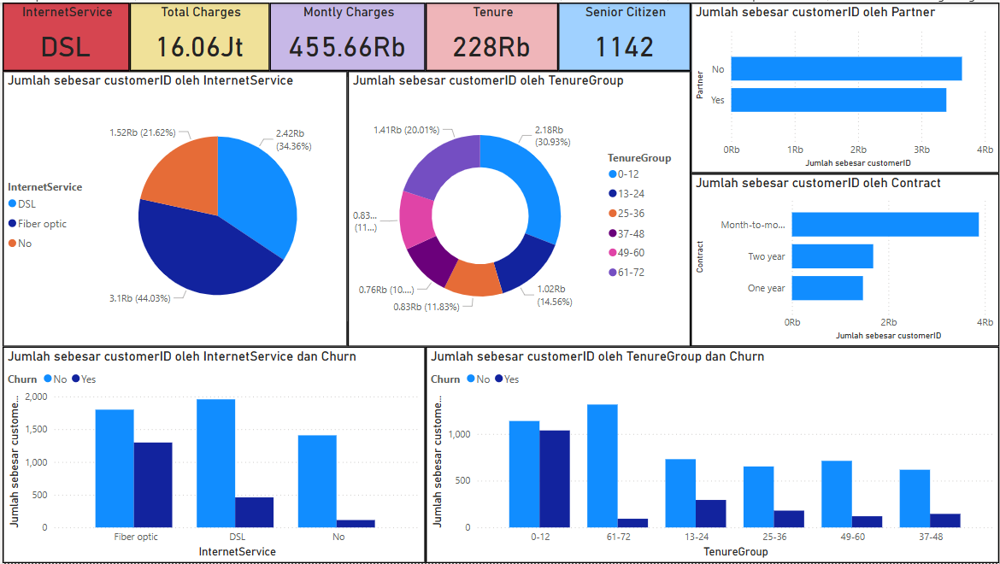

# 📊 Telco Customer Churn Analysis

Proyek ini menganalisis perilaku pelanggan dari sebuah perusahaan telekomunikasi, dengan tujuan untuk memahami pola pelanggan yang berhenti berlangganan (churn). Analisis ini dilakukan menggunakan dataset publik dan disertai dashboard visual sebagai penunjang insight.

## 📁 Dataset

- Sumber: [Kaggle - Telco Customer Churn](https://www.kaggle.com/datasets/blastchar/telco-customer-churn)
- Jumlah data awal: 7.043 baris, 21 kolom
- Jumlah setelah pembersihan: 7.032 baris

## 🛠 Tools & Teknologi

- Python (Jupyter Notebook)
- Power BI (Dashboard Visualisasi)
- GitHub (Repositori dokumentasi)

## 📌 Proses Analisis

1. **Import & Eksplorasi Awal**
   - Memuat data dan menampilkan struktur kolom
   - Meninjau ukuran data dan tipe tiap kolom

2. **Exploratory Data Analysis (EDA)**
   - Deskripsi statistik tiap kolom
   - Meninjau distribusi churn dan variabel terkait

3. **Data Cleaning**
   - Konversi kolom `TotalCharges` menjadi numerik
   - Menghapus baris dengan nilai kosong

4. **Visualisasi Insight**
   - Visualisasi berbasis Python (matplotlib/seaborn)
   - Fokus pada variabel yang berpengaruh terhadap churn

5. **Pembuatan Dashboard**
   - Visualisasi interaktif di Power BI
   - Menyusun insight bisnis dalam satu tampilan

## 🔍 Insight Utama

### 1. Jenis Kontrak vs Churn
- Pelanggan dengan kontrak `Month-to-month` memiliki tingkat churn tertinggi.
- Pelanggan dengan kontrak tahunan (1 atau 2 tahun) lebih cenderung bertahan.

📌 *Strategi*: Tawarkan insentif untuk kontrak jangka panjang agar churn menurun.

---

### 2. Layanan Internet vs Churn
- Pengguna **Fiber Optic** memiliki proporsi churn tertinggi.
- Pelanggan **tanpa internet** justru paling loyal.

📌 *Strategi*: Evaluasi pengalaman dan kepuasan pelanggan Fiber Optic.

---

### 3. Tenure Group vs Churn
- Churn paling tinggi terjadi pada pelanggan dengan masa langganan < 12 bulan.
- Setelah tahun pertama, pelanggan cenderung loyal.

📌 *Strategi*: Fokus pada retensi pelanggan selama 1 tahun pertama.

---

### 4. Monthly Charges Group vs Churn
- Churn tertinggi terjadi di kelompok biaya `Medium` dan `High`.
- Pelanggan di kelompok `Low` dan bahkan `Very High` justru lebih stabil.

📌 *Strategi*: Evaluasi value layanan pada paket `Medium` & `High`.

## 📈 Dashboard Power BI

Dashboard menampilkan:
- Komposisi churn vs pelanggan aktif
- Hubungan churn dengan jenis kontrak dan layanan internet
- Distribusi biaya dan lama berlangganan
- Insight visual tambahan dari kelompok pelanggan

## 💡 Kesimpulan

Analisis ini menyoroti pentingnya:
- Menyusun strategi onboarding untuk pelanggan baru
- Menjaga kualitas dan transparansi layanan berbiaya menengah
- Memberikan nilai yang sebanding untuk setiap jenis kontrak dan layanan

Dengan memahami karakteristik pelanggan yang churn, perusahaan dapat menyusun langkah taktis untuk meningkatkan retensi.

## 🧑‍💻 Author

**Ryan Sutan Wijaya**  
📧 [ryanw3312@gmail.com](mailto:ryanw3312@gmail.com)  
🌐 [linkedin.com/in/ryansutan](https://linkedin.com/in/ryansutan)
